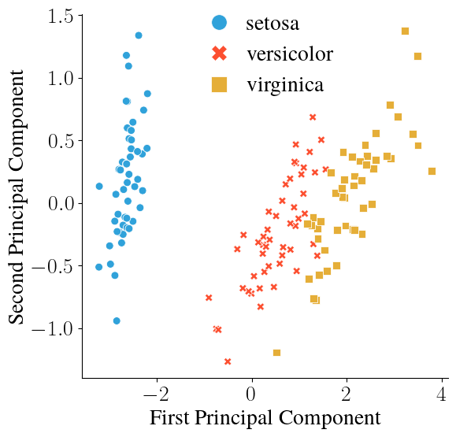

# infoviz
_Information Visualization Starter Kit_

## Setup

### Install `uv` ([documentation](https://docs.astral.sh/uv/))

On macOS and Linux:
```bash
curl -LsSf https://astral.sh/uv/install.sh | sh
```

On Windows:
```bash
powershell -ExecutionPolicy ByPass -c "irm https://astral.sh/uv/install.ps1 | iex"
```

### Initialize project

Creat a new folder (e.g., `infoviz`) and navigate to that folder in your shell.  
Then run:

```bash
uv init --no-workspace --no-readme --lib --name infoviz
```

This will create the following structure in your current working directory:
```
.
├── pyproject.toml
└── src
    └── infoviz
        ├── __init__.py	
        └── py.typed
```

The folder structure may look odd, but you don't need to worry about it. 
The setup has a number of workflow benefits (see below).

### Add packages

```bash
uv add pandas seaborn scipy numpy jupyterlab colorcet cmasher scikit-learn
```

This will install the named packages and add them to your project's dependencies.  
It will also create a `uv.lock` and a `.python-version`.

## Workflow Tips

### Work in interactive Jupyter notebooks

In the root of your main folder, run:

```bash
uv run jupyter lab
```

This will open an interactive coding environment in your browser.
I recommend creating a separate folder named `notebooks` for all your Jupyter notebooks (e.g., in your root directory).

### Write utility functions into package modules

For example, create a `utils.py` as a sibling of `__init__.py`, and put any functions you may want to reuse for different plots there.

I often use the following (if you have LaTeX installed locally, you can comment in the line currently starting with `#`, which will allow you to plot labels using LaTeX):

```python
import matplotlib.pyplot as plt

def set_rcParams(**kwargs):
    plt.rcParams['pdf.fonttype'] = 42
    plt.rcParams['text.usetex'] = True
    plt.rcParams['font.family'] = 'serif'
    # plt.rcParams['text.latex.preamble'] = r"\usepackage{amssymb}\usepackage{amsmath}\usepackage{times}"
    for k, v in kwargs.items():
        try:
            plt.rcParams[k] = v
        except KeyError:
            pass
```

Because you set up your project as a package, using `set_params` in a Jupyter notebook is as simple as:

```python
from infoviz.utils import set_rcParams
```

### Outsource frequent imports into helper scripts

You can run scripts in your Jupyter notebooks using so-called line magics (`%`), e.g., to run the script `helper.py`, you can do:

```python
%run helper.py
```

This can be useful to outsource imports that recur across many of your Jupyter notebooks. 

For example, I might add the following to my `helper.py`:

```python
import matplotlib.pyplot as plt
import seaborn as sns

import pandas as pd 
import seaborn as sns
import colorcet as cc

from infoviz.utils import set_rcParams

fontsize = 20
rcParams = {'figure.labelsize':fontsize, 'axes.labelsize':fontsize, 'xtick.labelsize':fontsize, 
            'ytick.labelsize':fontsize, 'legend.fontsize':fontsize, 'figure.titlesize':fontsize, 
            'axes.titlesize':fontsize, 'legend.frameon':False}
set_rcParams(**rcParams)
```

## Example Usage

Assuming you created `utils.py` and `helper.py` as in the workflow tips above, you can now do the following in a Jupyter notebook (say, `notebooks/pca.ipynb`) to perform dimensionality reduction on the `iris` dataset.

Run your helper script, import the necessary `scikit-learn` libraries, and create a `figures` directory:

```python
%run helper.py

from sklearn import datasets
from sklearn.decomposition import PCA

os.makedirs("../figures", exist_ok=True)
```

Load the `iris` dataset, perform PCA, and pour the results into a dataframe:

```python
iris = datasets.load_iris()

X = iris.data
y = iris.target
target_names = iris.target_names

pca = PCA(n_components=2)
X_r = pca.fit(X).transform(X)

df = pd.DataFrame(X_r, columns=["First Principal Component","Second Principal Component"])
df["y"] = y
```

Finally, plot the results using `seaborn`:

```python
fig, ax = plt.subplots(1,1, figsize=(6,6))
sns.scatterplot(df, x="First Principal Component", y="Second Principal Component", 
                hue="y", style="y", hue_order=[0,1,2], style_order=[0,1,2], 
                palette=cc.glasbey_hv[:3], s=50, markers=["o","X","s"]
               )
handles, labels = ax.get_legend_handles_labels()
ax.legend(handles, target_names, markerscale=2, handletextpad=0.25, borderpad=0, borderaxespad=0)
sns.despine(fig)
plt.savefig("../figures/pca-iris.png", bbox_inches="tight", transparent=False)
```



## Some Notes on Saving Plots
- Use vector formats (e.g., `.pdf`) to save figures wherever possible to enable smooth zooming. 
Raster formats (e.g., `.png`) will become pixelated when zooming in (but you may need them to use your figures in some presentation software, e.g., Google Slides).
- Set `transparent=True` to disable the white background. 
This is useful, e.g., when making figures for slides that have a non-white background color. 

